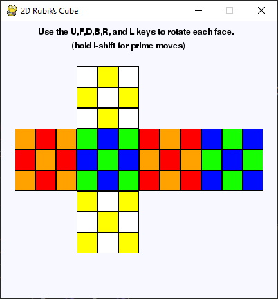

# 2D Rubik's Cube
**Description:** 2D Rubik's Cube made using Pygame that can turn with user input.

## Cube Rotation:
| Key | U | F | R | B | L | D |
|--|--|--|--|--|--|--|
| **Moves the:** | Top face | Front face | Right face | Back face | Left face | Bottom face |

>Use **SHIFT + KEY** to turn the desired face counter-clockwise

***Other Keys:***

 - Q: Quit the PyGame program and close the window.
 - S: Scramble the puzzle with 20 random moves (w/o 180 turns).
 - E: Escape the current puzzle state, return to solved state.

## Extra Information:
**Modify the code:** Use the [Trinket](https://trinket.io/pygame/1c0ccb5bdd) service to edit and remix the code live in the browser *(without setting up pygame)*

>*Set up Pygame to run the code locally:* [Add Pygame](https://stackoverflow.com/questions/28453854/add-pygame-module-in-pycharm-id)

*Note:* This program was converted to python from 2/16/2020 at 4:36pm to 3/18/2020 at 12:20pm. I originally coded this program in JavaScript using the P5JS library, and I decided to rewrite it in python.